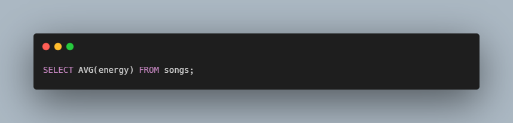

# SQL Songs Python - CS50

### Description

SQL queries to answer questions about a database of songs.

Using SQLite database which stores data from Spotify about songs and their artists. 
This dataset contains the top 100 streamed songs on Spotify in 2018. 

In the terminal we run sqlite3 songs.db so that we can begin executing queries on the database.

### How to use

1. SQL query to list the names of all songs in the database
2. SQL query to list the names of all songs in increasing order of tempo
3. SQL query to list the names of the top 5 longest songs, in descending order of length
4. SQL query to list names of songs that have a danceability, enery, and valence greater than 0.75
5. SQL query that returns the average energy of all the songs
6. SQL query that lists the names of songs that are by POst Malone
7. SQL query that returns the average energy of songs that are by Drake
8. SQL query that lists the names of the songs that feature other artists.

### Code Snippet

### Links

For more information about SQL songs visit: 

---------------------------------
[cs50 course](https://cs50.harvard.edu/x/2022/labs/7/)
---------------------------------------------------------------

